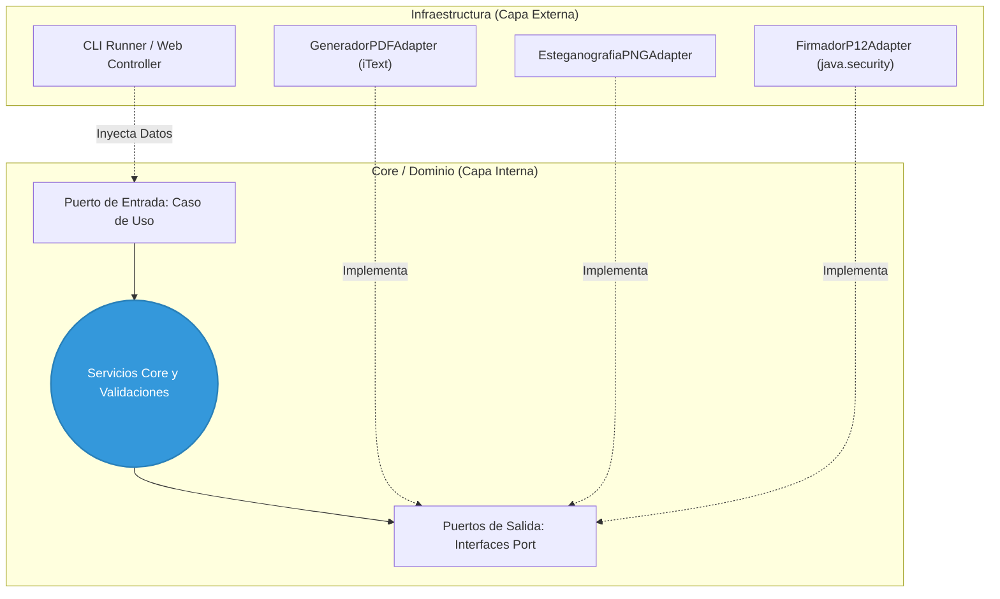
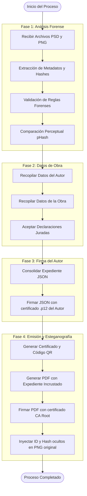
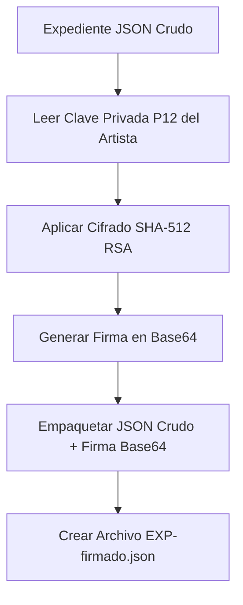
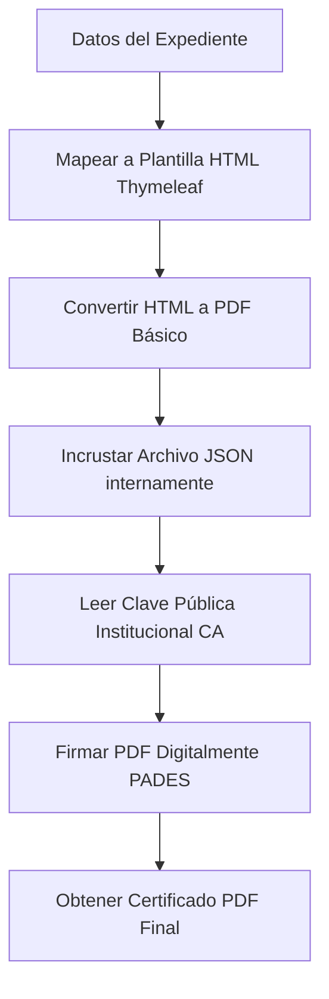
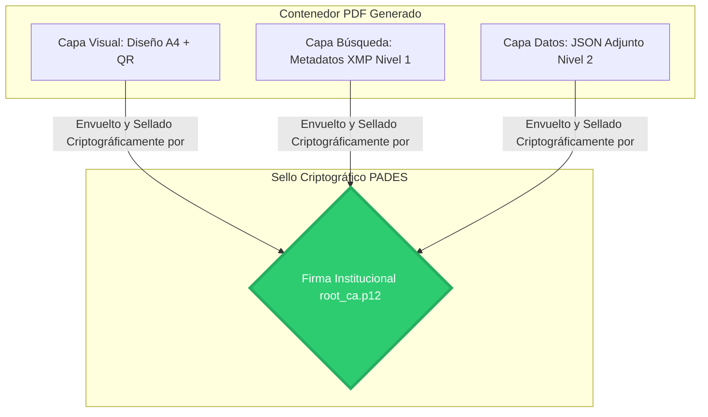

# Documentación del Módulo B: Análisis Forense y Certificación

## 1. Propósito de este módulo

El Módulo B es el motor pericial del sistema. Su propósito principal es **analizar, preservar y registrar evidencias de autoría** mediante procedimientos forenses, criptográficos y documentales. 
El módulo genera evidencia técnica verificable que permite demostrar la existencia de una obra digital en un momento determinado y conserva información relevante sobre su proceso de creación y autenticidad.

---

## 2. Certificados y Autoridad Raíz (ROOT CA)

En una Infraestructura de Clave Pública (PKI), la confianza no es automática: se construye mediante una jerarquía de autoridades certificadoras. En sistemas reales, esta confianza proviene de entidades externas. Sin embargo, en sistemas de investigación como nuestro sistema forense digital, se utiliza una ROOT CA propia.

En este sistema forense, NO existe acceso a una CA gubernamental real o integración con infraestructura nacional. Por lo tanto, se crea un punto de confianza propio (`root_ca.p12`).

### Razones Técnicas
1.  **Control total del sistema:** Se define quién firma, qué se firma y cómo se valida.
2.  **Sistema cerrado (forense):** El sistema no necesita ser válido en Internet, sino solo dentro de su ecosistema.
3.  **Simulación real de PKI:** Una ROOT CA propia reproduce la jerarquía de confianza, firma y verificación de integridad de forma idéntica a la vida real.
4.  **Independencia de terceros:** No se depende de gobiernos o empresas externas.
5.  **Reproducibilidad académica:** El sistema puede ejecutarse en cualquier máquina sin caducar o depender de APIs.

### Diferencia Clave con Sistemas Reales
| Característica | Mundo Real | Nuestro Sistema |
| --- | --- | --- |
| **ROOT CA** | Preinstalada globalmente en OS/Navegadores | Creada y validada localmente |
| **Validez Legal** | Estatal e Internacional | Académica / Soporte Técnico Forense |
| **Dependencia** | Alta (Entidades externas pagas/públicas) | Ninguna (Autónomo) |

### Justificación Académica para la Tesis
*En el presente modulo se implementa una Autoridad Certificadora raíz (ROOT CA) simulada, con el objetivo de establecer un punto de confianza dentro de una infraestructura de clave pública (PKI) cerrada.*

*En sistemas reales, la confianza en certificados digitales proviene de autoridades certificadoras raíz preinstaladas en sistemas operativos y navegadores, las cuales actúan como anclas de confianza global. Sin embargo, en entornos controlados o de investigación, no es posible ni necesario depender de infraestructuras externas.*

*Por ello, la ROOT CA implementada en este sistema cumple la función de autoridad de confianza interna, permitiendo la emisión y validación de certificados digitales utilizados para la firma de documentos, garantizando integridad y autenticidad dentro del sistema forense propuesto.*

### Recomendación en la Nube
Para fines del prototipo el certificado se aloja en el servidor. Si el prototipo se despliega en la nube, es vital resguardar la ROOT CA de forma segura (Ej. Azure Key Vault) y referenciarla mediante variables de entorno (`CA_KEYSTORE_PATH`) para no invalidar los certificados emitidos previamente.

---

## 3. Arquitectura del Proyecto (Arquitectura Hexagonal)

El diseño estructural del sistema se fundamenta rigurosamente en los principios de la **Arquitectura Hexagonal** (Ports & Adapters). Este enfoque garantiza un desacoplamiento absoluto entre el núcleo de la aplicación —donde residen las reglas de negocio y las complejas validaciones forenses— y los mecanismos tecnológicos externos responsables de la infraestructura.

El objetivo principal es proteger y aislar la lógica pericial frente a la obsolescencia o cambios tecnológicos. **Por esta estricta razón, todo el paquete `core` está escrito exclusivamente en Java Puro**, sin importar dependencias externas (como Spring, iText, Jackson, etc.).

Dentro de este ecosistema puro (el Core), existen dos tipos de interfaces:
1. **Interfaces Internas del Dominio:** Como `EstadoProceso` o `EventListener`. Estas interfaces viven 100% dentro del Core, manejando la lógica de negocio.
2. **Puertos (Interfaces de Frontera):** Interfaces abstractas que definen requerimientos que necesitan contacto con el mundo exterior (ej. guardar un archivo). El Core dicta el contrato (el *qué*).

**Adaptadores (Infraestructura):** Implementaciones tecnológicas concretas de los puertos (el *cómo*), utilizando herramientas específicas.

**Diagrama de Arquitectura Hexagonal:**


**Desglose del Código Fuente (Paquetes de la Arquitectura):**
*   `ec.edu.uce.certificadorforense.core` (El Núcleo Puro):
    *   `model/`: Entidades inmutables de dominio (`Expediente`, `Obra`, `Autor`, `ArchivoPSD`). No tienen anotaciones de base de datos ni dependencias externas.
    *   `ports/`: Interfaces de entrada (`in`) para definir casos de uso y de salida (`out`) para requerir adaptadores.
    *   `service/`: Lógica central, como el `ValidadorGenericoService` que orquesta las reglas forenses.
    *   `state/`: Implementación del patrón State con `ContextoProceso` y las clases de cada fase (`AnalisisForenseState`, `DatosObraState`, etc.).
    *   `rules/`: Reglas forenses individuales basadas en el patrón Strategy.
    *   `observer/`: Definición de eventos asíncronos y listeners del dominio (Audit Trail).
*   `ec.edu.uce.certificadorforense.infrastructure.adapters` (Mundo Exterior):
    *   `db/`: Repositorios Panache y entidades Hibernate (`ExpedienteForenseEntity`, `ObraEntity`) mapeadas a PostgreSQL.
    *   `rest/`: Controladores JAX-RS (Endpoints) y DTOs para comunicación HTTP con el frontend.
    *   `extractors/` y `processors/`: Lectura secuencial a bajo nivel de PSDs e imágenes sin sobrecargar la RAM.
    *   `esteganografia/`: Adaptadores binarios para inyectar payloads JSON en PNG (`tEXt`) y JPEG (`APP11`).
    *   `pdf/` y `firma/`: Generación documental con iText y sellado criptográfico PKCS#12 con Java Security.
    *   `qr/`: Generación de códigos bidimensionales (ZXing).
    *   `json/`: Serialización determinista del expediente (Gson).
    *   `hash/`: Generación de firmas SHA-512 y cálculo matemático del pHash (Perceptual Hash).

**Ejemplo Práctico en el Código:**

1. **En el Core (Capa Interna):** Solo definimos *QUÉ* necesitamos hacer.
```java
// src/main/java/ec/edu/uce/certificadorforense/core/ports/out/EsteganografiaPort.java
public interface EsteganografiaPort {
    byte[] inyectar(byte[] imagenOriginal, String jsonCertificacion);
    String extraer(byte[] imagenCertificada);
}
```

2. **En la Infraestructura (Capa Externa):** Definimos *CÓMO* se hace.
```java
// src/main/java/ec/edu/uce/certificadorforense/infrastructure/adapters/esteganografia/EsteganografiaPNGAdapter.java
public class EsteganografiaPNGAdapter implements EsteganografiaPort {
    @Override
    public byte[] inyectar(byte[] imagenOriginal, String jsonCertificacion) {
        // Lógica de inyección binaria específica para formato PNG (Chunk tEXt)
    }
}
```
*Ventaja clave:* Si en el futuro se quiere soportar esteganografía en TIFF, solo se crea un `EsteganografiaTIFFAdapter` sin alterar el Core.

### Justificación de las Decisiones Arquitectónicas y Alcance Jurídico
La plataforma no tiene como objetivo reemplazar a las entidades gubernamentales encargadas del registro de propiedad intelectual. Su función consiste en generar evidencia técnica verificable. 
Se decidió operar de manera independiente de organismos estatales debido a:
1. **Alcance académico y de investigación:** Implementar una infraestructura equivalente a una Autoridad de Certificación oficial excede los objetivos y recursos.
2. **Complejidad regulatoria:** Evitar políticas formales que no forman parte del alcance de este trabajo.
3. **Enfoque en evidencia técnica:** El valor radica en el análisis forense, hashes SHA-512, esteganografía y firma electrónica.
4. **Portabilidad tecnológica:** Al no depender de plataformas gubernamentales, el sistema puede ejecutarse localmente o desplegarse en cualquier nube.

---

## 4. Patrones de Diseño Utilizados

<a name="patron-state"></a>
### 4.1 Patrón State (Máquina de Estados del Proceso)
*   **¿Cómo funciona?** El flujo de certificación se comporta como una máquina de estados finitos que atraviesa 4 etapas secuenciales (`AnalisisForenseState` → `DatosObraState` → `FirmaAutorState` → `CertificacionState`). Cada estado encapsula la lógica para procesar, validar y transicionar a la siguiente fase, garantizando que ninguna validación forense o paso legal se omita. Todos los estados comparten un `ContextoProceso` que acumula los datos generados (hashes, expediente, etc.).
*   **¿Dónde se encuentra?** En el paquete `src/main/java/ec/edu/uce/certificadorforense/core/state/`. Aquí residen la interfaz base (`EstadoProceso.java`), la entidad contenedora (`ContextoProceso.java`) y todas las clases concretas.
*   **¿Cómo se emplea?** Se ejecuta `ejecutar(contexto)` para la lógica principal, `validar(contexto)` para verificar la integridad, y finalmente `avanzar(contexto)` para que el patrón asigne automáticamente la siguiente clase de estado, evitando condicionales masivos (`if/else`).

### 4.2 Patrón Observer
Gestiona la publicación de eventos asíncronos (`EventoAnalisisIniciado`, `EventoFirmaRealizada`, etc.) permitiendo a distintos módulos reaccionar (como audit trails o logs) sin acoplarse al código de certificación central.

### 4.3 Patrón Strategy
Se utiliza de forma extensiva en la `ValidadorGenericoService`, permitiendo que las reglas de validación forense sean intercambiables y aplicadas dinámicamente como una lista de estrategias sin alterar la clase contenedora.

---

## 5. MicroProfile y Tecnologías Base

El proyecto está desarrollado sobre **Quarkus** (`io.quarkus:quarkus-bom`), aprovechando las especificaciones de **Eclipse MicroProfile** para aplicaciones Cloud Native:

*   **Configuración (MicroProfile Config):** Inyección de variables de entorno mediante `@ConfigProperty` para evitar configuraciones hardcodeadas (ej. contraseñas, URLs de BD).
*   **Context and Dependency Injection (CDI):** Uso intensivo de `@ApplicationScoped` y `@Inject` para manejar el ciclo de vida de los adaptadores y servicios.
*   **JSON-B / REST:** Exposición de endpoints asíncronos y serialización JSON estándar, ideal para arquitecturas modernas.

### Mapa de Dependencias del Proyecto
El `build.gradle.kts` refleja una selección estricta de librerías para cubrir las necesidades periciales sin romper la arquitectura:

*   **Framework Base:** `io.quarkus:quarkus-bom` (Motor Cloud Native).
*   **API y REST:** `quarkus-rest`, `quarkus-rest-jsonb` (Endpoints y serialización base).
*   **Persistencia:** `quarkus-hibernate-orm-panache`, `quarkus-jdbc-postgresql`, `quarkus-flyway` (Manejo de BD y control de versiones del esquema SQL).
*   **Análisis Forense (Fase 1):** 
    *   `com.drewnoakes:metadata-extractor` (Extracción profunda de EXIF, XMP e ICC Profiles).
    *   `com.twelvemonkeys.imageio:imageio-psd` (Lectura y compositeado nativo de archivos Photoshop sin requerir software de Adobe).
*   **Serialización Determinista (Fases 2 y 3):** `com.google.code.gson:gson` (Usado en el adaptador JSON para construir el wrapper firmado).
*   **Certificación y Emisión (Fase 4):**
    *   `com.itextpdf:itext7-core` y `html2pdf` (Generación de PDF).
    *   `com.itextpdf:sign` y `org.bouncycastle:bcpkix-jdk15on` (Inyección de archivos adjuntos y firma avanzada PADES-CMS).
    *   `org.thymeleaf:thymeleaf` (Motor de plantillas HTML para el diseño del certificado).
    *   `com.google.zxing:core` (Generación del código QR).
*   **Reducción de Boilerplate:** `org.projectlombok:lombok` (Para constructores y el patrón `@Builder` en las entidades del Core).

---

## 6. Estructura de la Base de Datos Relacional

Para soportar la estrategia arquitectónica, el siguiente esquema de base de datos SQL define cómo persistir el proceso forense (Ej. PostgreSQL). Está fuertemente normalizado para evitar redundancia y proteger la inmutabilidad de los datos.

### Ciclo de Vida de Inserción (Mapping por Fases)
*   **Fase 1 (Análisis Forense):** Se crea el registro base en `expedientes_forenses` y se guarda el análisis extraído automáticamente. *Nota: El hash del PSD es UNIQUE para evitar duplicados.*
*   **Fase 2 (Datos Declarados):** Se inserta o recupera al usuario en `usuarios` y se registra la información en `obras`.
*   **Fase 3 (Firma Autor):** Se inserta el resultado de la firma en `firmas_autor`.
*   **Fase 4 (Certificación):** Se inserta el núcleo del sistema en la tabla `certificados` guardando el PDF original en crudo (SINGLE SOURCE OF TRUTH).

```sql
-- 1. USUARIOS (Módulo A: Registro Web)
CREATE TABLE usuarios (
    id UUID PRIMARY KEY,
    cedula VARCHAR(20) NOT NULL UNIQUE,
    nombres VARCHAR(100) NOT NULL,
    apellidos VARCHAR(100) NOT NULL,
    correo VARCHAR(150) NOT NULL UNIQUE,
    nombre_artistico VARCHAR(100),
    password_hash VARCHAR(255) NOT NULL,
    acepta_terminos_plataforma BOOLEAN DEFAULT FALSE,
    fecha_registro TIMESTAMP NOT NULL DEFAULT NOW(),
    activo BOOLEAN DEFAULT TRUE
);

-- 2. OBRAS
CREATE TABLE obras (
    id UUID PRIMARY KEY,
    usuario_id UUID NOT NULL REFERENCES usuarios(id),
    titulo VARCHAR(255) NOT NULL,
    descripcion TEXT,
    categoria VARCHAR(50),
    software VARCHAR(120),
    hardware VARCHAR(120),
    fecha_creacion DATE,
    fecha_registro TIMESTAMP NOT NULL DEFAULT NOW(),
    estado_actual VARCHAR(50) NOT NULL
);

-- 2.1. DECLARACIONES LEGALES DE LA OBRA
CREATE TABLE declaraciones_obra (
    id UUID PRIMARY KEY,
    obra_id UUID NOT NULL UNIQUE REFERENCES obras(id),
    es_titular_derechos BOOLEAN NOT NULL DEFAULT FALSE,
    acepta_terminos_certificacion BOOLEAN NOT NULL DEFAULT FALSE,
    fecha_aceptacion TIMESTAMP NOT NULL DEFAULT NOW(),
    ip_registro VARCHAR(45)
);

-- 3. EXPEDIENTES / ANÁLISIS FORENSE
CREATE TABLE expedientes_forenses (
    id UUID PRIMARY KEY,
    obra_id UUID NOT NULL UNIQUE REFERENCES obras(id),
    hash_psd_original TEXT NOT NULL UNIQUE, 
    hash_imagen_final TEXT NOT NULL,
    similitud_phash DECIMAL(5,2),
    resultado_analisis VARCHAR(50) NOT NULL,
    evidencia_tecnica JSONB NOT NULL, 
    fecha_analisis TIMESTAMP NOT NULL DEFAULT NOW()
);

-- 4. FIRMAS DIGITALES DEL AUTOR
CREATE TABLE firmas_autor (
    id UUID PRIMARY KEY,
    expediente_id UUID NOT NULL UNIQUE REFERENCES expedientes_forenses(id),
    usuario_id UUID NOT NULL REFERENCES usuarios(id),
    hash_firmado TEXT NOT NULL,
    firma_base64 TEXT NOT NULL,
    algoritmo VARCHAR(50) NOT NULL,
    fecha_firma TIMESTAMP NOT NULL DEFAULT NOW()
);

-- 5. CERTIFICADOS EMITIDOS
CREATE TABLE certificados (
    id UUID PRIMARY KEY,
    obra_id UUID NOT NULL UNIQUE REFERENCES obras(id),
    numero_certificado VARCHAR(100) UNIQUE NOT NULL,
    expediente_firmado_raw TEXT NOT NULL, -- SINGLE SOURCE OF TRUTH (El archivo legal intacto)
    hash_certificado TEXT NOT NULL, 
    fecha_emision TIMESTAMP NOT NULL DEFAULT NOW()
);

-- 6. HISTORIAL DE ESTADOS
CREATE TABLE historial_estados (
    id UUID PRIMARY KEY,
    obra_id UUID NOT NULL REFERENCES obras(id),
    estado_anterior VARCHAR(50),
    estado_nuevo VARCHAR(50) NOT NULL,
    observacion TEXT,
    fecha_cambio TIMESTAMP NOT NULL DEFAULT NOW()
);
```

---

## 7. Los 12 Factores (12-Factor App)

Este módulo se diseñó siguiendo los preceptos 12-Factor:
1.  **Codebase:** Un único repositorio versionado.
2.  **Dependencies:** Dependencias explícitas en `build.gradle.kts`.
3.  **Config:** La CA, usuarios y passwords de DB se inyectan vía variables de entorno.
4.  **Backing services:** PostgreSQL tratado como recurso adjunto.
5.  **Build, release, run:** Empaquetado estricto (Quarkus JAR/Native).
6.  **Processes (Stateless):** El módulo no guarda estados en memoria RAM entre peticiones; las firmas y archivos temporales fluyen a disco temporal o BD (Zero-File Retention).
7.  **Port binding:** Exposición autónoma vía HTTP.

---

## 8. Estrategia de Almacenamiento a Futuro (Zero-File Retention)

El diseño arquitectónico del sistema estipula que a futuro **no se deben almacenar archivos físicos (ni PSD, ni PNG, ni PDF)** en la infraestructura del servidor, sino **únicamente datos (El Expediente JSON)**.

Esta decisión responde a las siguientes justificaciones técnicas y legales:
1.  **Ahorro Masivo de Costos:** Almacenar documentos JSON estructurados requiere un espacio minúsculo en comparación con los Gigabytes de archivos PSD.
2.  **Cero Responsabilidad sobre Propiedad Intelectual:** Al no alojar las imágenes fuente, el sistema se exime de responsabilidades legales por filtración de obras de arte. El sistema actúa exclusivamente como un "Notario Digital".
3.  **La Criptografía Sustituye al Archivo:** La Fase 1 extrae el **Hash SHA-512** del archivo y lo sella dentro del Expediente firmado. Si el autor presenta su PSD en un tribunal, al recalcular el hash, coincidirá matemáticamente con el perpetuado en el sistema.
4.  **Generación Bajo Demanda:** Dado que el sistema conserva los datos inmutables del Expediente, el certificado PDF podría ser regenerado matemáticamente y vuelto a firmar en cualquier momento.

---

## 9. Flujo General del Análisis y Certificación

El proceso completo se divide en 4 fases principales, controladas mediante el patrón [**State**](#patron-state), asegurando que no se pueda omitir ninguna validación forense.



### Detalles Técnicos por Fase

### Fase 1: Análisis Forense Digital
Esta fase representa el filtro crítico para asegurar que las obras no han sido falsificadas. Se divide en el análisis estructural a bajo nivel y las validaciones forenses.

**Dependencias Involucradas:**
*   `com.drewnoakes:metadata-extractor`: Extracción de metadatos profundos (EXIF, perfiles de color) de las imágenes.
*   `com.twelvemonkeys.imageio:imageio-psd`: Permite renderizar y leer archivos PSD usando `ImageIO.read()` para lograr hacer el compositeado (combinación visual) y generar la imagen comparativa del pHash.

#### Análisis de Metadatos y Estructura a Bajo Nivel (PSD e Imágenes)
El sistema no confía en la extensión del archivo. En lugar de cargar las imágenes completas en la memoria RAM (lo cual podría causar un `OutOfMemoryError` con archivos pesados), el sistema utiliza lectura secuencial binaria (`DataInputStream`). Se aplican saltos estratégicos (`skipBytes`) para descartar los bloques de píxeles puros y parsear únicamente las cabeceras binarias y la metadata esencial.

**Para archivos PSD:** Se valida la firma "8BPS" y se analizan las dimensiones, cantidad de canales y detalles de cada capa sin renderizarla.
```java
// Ahorro de Memoria: Lectura de capas descartando bytes de píxeles (skipBytes)
int cantidadCapas = Math.abs(dis.readShort());
for (int i = 0; i < cantidadCapas; i++) {
    int top = dis.readInt(), left = dis.readInt(), bottom = dis.readInt(), right = dis.readInt();
    skipExacto(dis, 4); // Firma "8BIM"
    byte[] blendBytes = new byte[4];
    dis.readFully(blendBytes);
    // ... se extraen metadatos capa por capa
}
```

**Para imágenes PNG / JPEG:** Se extrae la densidad de píxeles (DPI) buscando el chunk `pHYs` en PNG o el segmento `APP0` en JPEG sin cargar la imagen a RAM.

#### Validación de Reglas (Patrón Strategy)
Una vez parseado a un objeto de dominio (`ArchivoPSD` o `ArchivoImagen`), se somete a validaciones usando un Validador Genérico.
```java
public VeredictoFinal validar(T objeto) {
    VeredictoFinal veredicto = new VeredictoFinal();
    for (IReglaValidacion<T> regla : reglas) {
        ResultadoValidacion resultado = regla.validar(objeto);
        veredicto.agregarResultado(resultado, regla.esCritica());
        if (veredicto.isEsRechazado()) break; // Cortocircuito si la regla es crítica
    }
    return veredicto;
}
```

#### Comparación Perceptual (pHash)
Se valida si el lienzo interno del PSD y la imagen renderizada final se ven igual para el ojo humano (>= 95% de similitud).

```java
public String generarHash(BufferedImage imagen) {
    Image escala = imagen.getScaledInstance(8, 8, Image.SCALE_SMOOTH);
    // ...
    StringBuilder hash = new StringBuilder();
    for (int y = 0; y < 8; y++) {
        for (int x = 0; x < 8; x++) {
            hash.append((miniatura.getRGB(x, y) & 0xFF) >= promedio ? "1" : "0");
        }
    }
    return hash.toString();
}
```

---

### Fase 2: Datos de la Obra y Autor
En esta fase, **el sistema solicita la información declarativa** por parte del artista. El sistema recolecta los datos legales y descriptivos y los fusiona con los resultados forenses de la Fase 1.

**Dependencias Involucradas:**
*   `com.google.code.gson:gson`: Serialización profunda para convertir el objeto `Expediente` de manera determinista en un JSON estructurado.

Como resultado, el servicio consolida un objeto JSON con la siguiente estructura inicial:
```json
{
  "idExpediente": "EXP-2026-000001",
  "autor": { "nombres": "Artista", "cedula": "0000000000" },
  "obra": { "titulo": "Obra de Integracion", "categoria": "ILUSTRACION" },
  "analisis": { "resultado": "APROBADO", "capasPSD": 123 },
  "hashes": {
    "sha512PSD": "0e971e9a0b...",
    "sha512Imagen": "e70561311...",
    "pHash": "000000010011..."
  }
}
```

---

### Fase 3: Firma del Expediente y Almacenamiento

Una vez estructurado el expediente, se procede a su firma criptográfica. 



**Manejo del `.p12` (Zero-File Retention):**
El archivo `.p12` se solicita en la petición, **se aloja temporalmente en memoria**, se extrae la clave, se realiza la firma y luego **se destruye inmediatamente**, sin almacenarse jamás en el servidor.

**Criptografía y SHA-512:**
El algoritmo usado es `SHA512withRSA`. **SHA-512** es netamente superior a SHA-256 porque incrementa el espacio de colisión exponencialmente, haciendo que la falsificación de la evidencia forense sea computacionalmente inviable.

**Dependencias Involucradas:**
*   `java.security.*`: Para instanciar `KeyStore` y `Signature`.
*   `org.bouncycastle`: Proveedor de seguridad reforzado.

```java
// Fragmento de validación de firma en FirmadorP12Adapter (En Memoria)
KeyStore keystore = KeyStore.getInstance("PKCS12");
keystore.load(new FileInputStream(p12File), password.toCharArray());
String alias = keystore.aliases().nextElement();
X509Certificate cert = (X509Certificate) keystore.getCertificate(alias);
cert.checkValidity(); // Lanzará excepción si expiró (Pero NO consulta OCSP/CRL)
```

Al guardar el expediente, se genera un "Wrapper" firmado:
```json
{
  "expedienteJson": "{\"idExpediente\":\"EXP-1\", ... }",
  "firmaBase64": "vjB3x/Q8aL9kF3... (Firma SHA512withRSA del autor)"
}
```

---

### Fase 4: Emisión del Certificado

El último paso corresponde a la generación documental. Se inyectan las variables al PDF vía **Thymeleaf + iText 7**. Finalmente, si el archivo es PNG/JPEG, se aplica esteganografía.



#### ¿Qué se inserta en la imagen (PNG y JPEG)?
**NO se inserta todo el expediente** para no corromper la imagen. Se inyecta un JSON miniatura: `{"id":"CERT-12345", "hash":"a1b2c3d4..."}`.

*   **En PNG:** Se inyecta un chunk `tEXt` justo antes del marcador `IEND`.
*   **En JPEG:** Se inyecta un segmento `APP11` justo después del marcador `SOI`.

#### ¿Qué se inserta en el Certificado (PDF)?
El PDF recibe 3 niveles de seguridad pesada:

1.  **A nivel visual:** Textos legibles y el Código QR de validación.
2.  **A nivel binario (Archivo Adjunto):** El sistema **incrusta literalmente el archivo `expediente-firmado.json` íntegro** dentro de la estructura del PDF (Nivel 2). Esto asegura que la firma legal del artista viaje permanentemente con el certificado.
3.  **A nivel criptográfico:** El archivo PDF completo es envuelto y firmado digitalmente (PADES - CMS) usando la clave privada institucional (`root_ca.p12`).



```text
Estructura Binaria del Certificado PDF Firmado:
┌─────────────────────────────────────────┐
│ %PDF-1.7 (Cabecera)                     │
├─────────────────────────────────────────┤
│ Catalog (Catálogo Raíz del Documento)   │
│  ├─ Pages (Capa Visual A4, QR)          │
│  ├─ Metadata XMP (Nivel 1)              │ ◄── [ INYECCIÓN: Keywords y Hash ]
│  └─ EmbeddedFiles (Nivel 2)             │
│      └─ [ INYECCIÓN: expediente-firmado.json ]
├─────────────────────────────────────────┤
│ Diccionario de Firma (Nivel 3)          │ ◄── (Añadido por PADES SHA-512)
│  └─ [ Sello Criptográfico CMS/PKCS7 ]   │
├─────────────────────────────────────────┤
│ %EOF (Fin de Archivo)                   │
└─────────────────────────────────────────┘
```

El flujo de confianza funciona de la siguiente manera: Si alguien tiene la imagen certificada, extrae el texto oculto (`id` y `hash`). Luego, extrae el JSON adjunto del PDF, recalcula su hash SHA-512 y lo compara con el `hash` oculto esteganográficamente en la imagen. Si ambos hashes son idénticos, la imagen y el expediente están criptográficamente vinculados.
